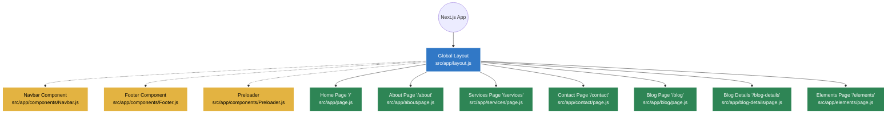

# Final Architecture & Tech Stack Overview

## 1. Tech Stack
- **Framework**: Next.js 15 (App Router Architecture)
- **UI Library**: React 19
- **Styling**: Vanilla CSS, Bootstrap (loaded via public assets)
- **Scripts & Plugins**: jQuery, Slick Carousel, Owl Carousel, WOW.js, Magnific Popup (loaded as static assets)
- **Code Quality**: ESLint

---

## 2. Page to File Mapping (Flow Chart)

Below is an easy-to-read flow chart showing exactly which file controls which web page in your new React application.



---

## 3. Detailed Folder Tree

Here is the exact folder structure of your Next.js application, highlighting the purpose of each directory.

```text
Web-Hosting-Service/
├── .env.local                    # Stores environment variables (e.g., API Keys) safely
├── next.config.js                # Next.js configuration settings
├── package.json                  # Node.js dependencies and scripts (React 19, Next 15)
├── public/                       # Publicly accessible static files
│   ├── assets/                   # Carried over from legacy HTML site
│   │   ├── css/                  # Legacy stylesheets (Bootstrap, plugins, style.css)
│   │   ├── fonts/                # Custom fonts (Flaticon, FontAwesome, Themify)
│   │   ├── img/                  # All images and graphics used on the site
│   │   └── js/                   # Legacy scripts (jQuery, Slick, WOW.js, main.js)
│   └── site.webmanifest          # PWA/Favicon manifest
└── src/
    └── app/                      # App Router Directory (Next.js 15)
        ├── globals.css           # Global CSS overrides for the React app
        ├── layout.js             # The main wrapper layout (contains Header, Footer, Scripts)
        ├── page.js               # Code and JSX for the Home page (/)
        │
        ├── about/
        │   └── page.js           # Code and JSX for the About page (/about)
        ├── blog/
        │   └── page.js           # Code and JSX for the Blog page (/blog)
        ├── blog-details/
        │   └── page.js           # Code and JSX for the Blog Details page (/blog-details)
        ├── contact/
        │   └── page.js           # Code and JSX for the Contact page (/contact)
        ├── elements/
        │   └── page.js           # Code and JSX for the Elements page (/elements)
        ├── services/
        │   └── page.js           # Code and JSX for the Services page (/services)
        │
        └── components/           # Reusable React components
            ├── BackToTop.js      # Scroll to top button logic
            ├── Footer.js         # Footer UI component
            ├── Navbar.js         # Header/Navbar UI component
            ├── Preloader.js      # Initial loading spinner UI
            ├── PreloaderController.js # Logic to handle removing the preloader
            └── TemplateScripts.js# Script loader for the legacy JS plugins
```

### Explanation of the Architecture:
1. **Routing (`src/app/*/page.js`)**: In Next.js, every folder inside `src/app/` automatically becomes a route URL. The `page.js` file inside it acts as the screen for that URL.
2. **Layout (`src/app/layout.js`)**: This file wraps all the pages. It automatically mounts the `Navbar`, `Footer`, and legacy `TemplateScripts` on every page so you don't have to rewrite them.
3. **Standalone Components (`src/app/*/page.js`)**: Unlike the previous setup, each page now contains its own complete, properly formatted React JSX code. This makes it extremely easy to open a single file (like `src/app/about/page.js`) and modify the content of that exact page directly.
4. **Static Assets (`public/assets/`)**: All CSS, Fonts, Images, and jQuery Scripts from your previous HTML version live here and are served statically to preserve the original design.
